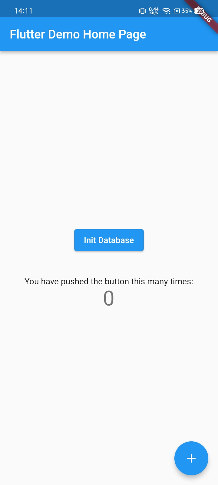
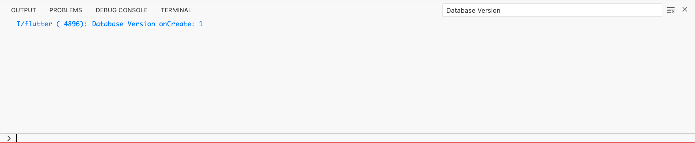
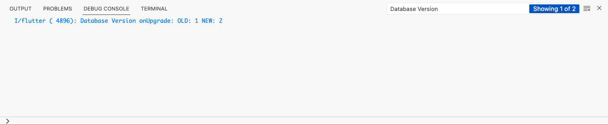
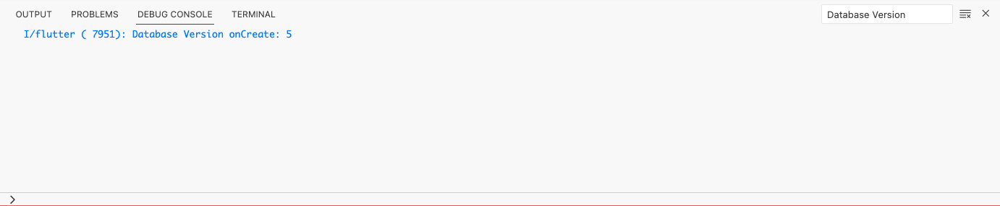
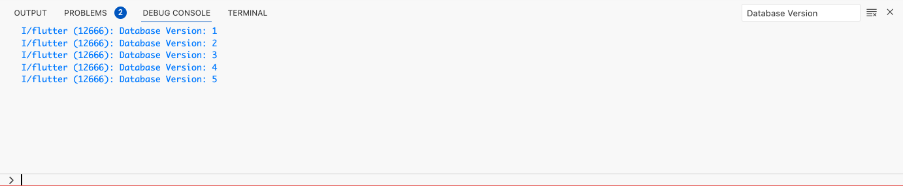
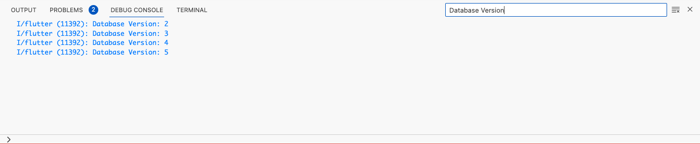

# Flutter Sqflite onUpgrade

Hi! I'm trying to understand how **onUpgread()** or we can say database migration works in the **SQLite** database, I thought let's share my experience on it so, everyone can get ideas and implement it accordingly.

## Let's Start

I've created one sample app there is one button with the name **Init Database** when the user taps on the button it will call the **init()** method of the database client for more info please check the code.

App looks like:

### Create or init database with the Version No. 1

    await  openDatabase(
    	dbPath,
    	version:  1,
    	onCreate: _createDb,
    );
    
    void  _createDb(Database  db, int  version) async {
    	debugPrint('Database Version onCreate: $version');
    }

ohh wow! it is so simple let's check output of the above code:

Yup! My work is done let me publish this app to the Play Store or App Store Hurray...!

### I realized I missed one column inside the table 

Now, what? let me upgrade the database but how? now comes in the picture **onUpgread()** method, please check the below code snippets.

    await  openDatabase(
    	dbPath,
    	version:  2,
    	onUpgrade: _upgradeDb,
    );
    
    void  _upgradeDb(Database  db, int  oldVersion, int  newVersion) {
    	debugPrint('Database Version onUpgrade: OLD: $oldVersion NEW: $newVersion');
    }

let's check output of the above code:

Seems like everything going well! Now as per need, I incremented the database version upto 5 and it behaves like this:

    Database Version onUpgrade: OLD: 2 NEW: 3
    Database Version onUpgrade: OLD: 3 NEW: 4
    Database Version onUpgrade: OLD: 4 NEW: 5

*Please note your last publish app has database version no **5***

### Now, users download the latest app from Play Store or App Store

oh my god! app database log is scary, check below log

What happens with the last 4 versions of the database like it is skipped? But if you read the documentation carefully over there mention like if the database file is not found then create a new file with the given version now look in the case your database version is 5 and you install the fresh app so the system creates a new database file with the version code 5.

## Let's work on the Solutions

It is final we have you follow in the sequential manner where is it a case of the onCreate or onUpgread() but how? Check below code snippets.

    await openDatabase(  
    	dbPath,  
    	version: 1,  
    	onCreate: (Database db, int newVersion) async {  
    		for (int version = 0; version < newVersion; version++) {  
    			await _performDbOperationsVersionWise(db, version + 1);  
    		}  
    	},  
    	onUpgrade: (Database db, int oldVersion, int newVersion) async {  
    		for (int version = oldVersion; version < newVersion; version++) {  
    			await _performDbOperationsVersionWise(db, version + 1);  
    		}  
    	},  
    );
    
    _performDbOperationsVersionWise(Database db, int version) async {  
    	switch (version) {  
    	case 1:  
    	await _databaseVersion1(db);  
    	break;  
    	case 2:  
    	await _databaseVersion2(db);  
    	break;  
    	case 3:  
    	await _databaseVersion3(db);  
    	break;  
    	case 4:  
    	await _databaseVersion4(db);  
    	break;  
    	case 5:  
    	await _databaseVersion5(db);  
    	break;  
    	}  
    }  
      
    _databaseVersion1(Database db) {  
    	debugPrint('Database Version: 1');  
    }
    ....

Let's consider the case of **onCreate()** now if we can install a fresh application and database version is 5 then it will execute all version one by one.

Let's consider the **onUpgrade()** case if the user has not updated the application for a long time (the user has an old application and considers **database version no 1**) and in meanwhile time **developer released 5 new database versions**, now what happens when user update the application with the latest database version 5?

it is time to jump from version 1 to 5 then it will consider all the versions between the old version to the new version check the below output.

## Conclusion

Automatically nothing happens while migrating the database, you have to do some logical work too.

If you like this article give a star, want to correct it give a pull, Happy Coding ...!!!

## About me

I'm Kishan Donga and you can connect with me via below links, I am a developer and I love to create innovations.

LinkedIn [@ikd96](https://www.linkedin.com/in/ikd96/) 
Email [kishandonga.92@gmail.com](mailto:kishandonga.92@gmail.com)
Twitter [@ikishan96](https://twitter.com/ikishan96) 
Instagram [@ikishan96](https://www.instagram.com/ikishan96/)